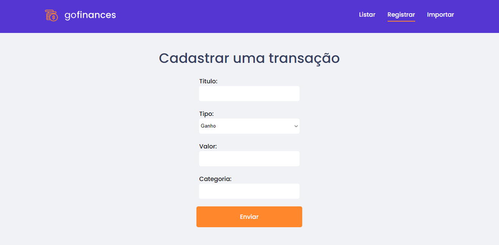
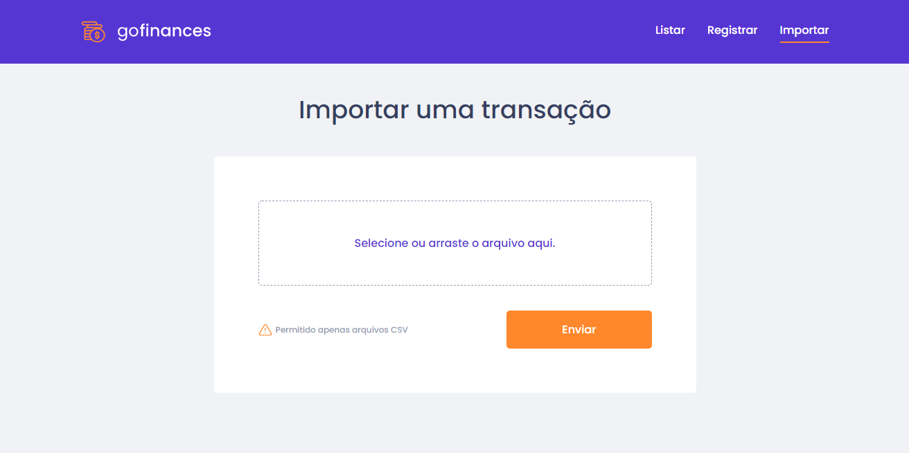

<h1 align="center" >
  
  
</h1>

<p align="center">GoFinances aplicação desenvolvida como desafio durante o Bootcamp GoStack</p>


<p align="center">
 <a href="#-sobre">Sobre</a> •
 <a href="#-layout">Layout</a> • 
 <a href="#-executando-o-GoFinances">Como executar</a> • 
 <a href="#-tecnologias">Tecnologias</a> 

</p>

---

## 💡 Sobre

Essa aplicação permite com que você controle suas finanças de uma forma simples e satisfatória permitindo a importação de arquivos csv.

Este projeto foi construído como desafio do bootcamp GoStack da [Rocketseat](https://rocketseat.com.br/).

---

## 🎨 Layout


### Web

<p align="center">
                                Dashboard
  
                          Cadastro de transações
  
                        Importação de arquivos csv
  
  
</p>
<br>


## 👌 Funcionalidades


* Dashboard visual que mostra todas as transações
* Cadastrar transações manualmente (Não estava no projeto original)
* Cadastrar transações via arquivo csv
  
<br>


---


## 💻 Executando o GoFinances

<br>

### Pré-requisitos

É necessário ter instalado na sua máquina para execução desse projeto:
- NodeJS
- Gerenciador de pacotes (Npm ou Yarn) 
- Banco de dados postgreSQL(Local ou através de docker)
  - caso opte por instalar o docker este é um tutorial de instalação      
   [](https://www.notion.so/Instala-o-do-Docker-8230846ae2c547b2988f2aca91fc1edf)
  - Com o docker instalado será necessário criar um container postgreSQL através do comando 
  ```bash 

    $ docker run --name nome -e POSTGRES_PASSWORD=senha -p 5432:5432  -d postgres

    ```
    - O retorno será o id do container criado e isso indica que tudo está funcionando 
    - Agora será preciso acessar o banco de dados através de um software adequado (Beekeeper studio,DBeaver) e criar um banco de dados que sera usado no .env
  

### ♊ Clonando o Repositório

```bash

$ git clone https://github.com/johnldev/GoFinances

# entre na pasta do projeto

$ cd GoFinances

```
### 💻 Rodando o GoFinances web

Entre na pasta

```bash

$ cd web

```
Instale as dependências

```bash

$ yarn

# ou, caso use npm

$ npm install

```

Rode a aplicação

```bash

$ yarn start

# ou, caso use npm

$ npm run start

```


### 🌐 Rodando o Servidor

Entre na pasta

```bash

$ cd back-end

```
Instale as dependências

```bash

$ yarn

# ou, caso use npm

$ npm install

```

- Nesse momento crie um arquivo .env na raiz do projeto e o preencha com os dados do seu banco de dados utilizando o arquivo .env-example como exemplo

Modele o banco de dados

```bash

$ yarn typeorm migration:run

# ou, caso use npm

$ npm run typeorm migration:run

```

Rode o servidor

```bash

$ yarn dev:server

# ou, caso use npm

$ npm run dev:server

```


### 📱 Rodando o GoFinances mobile 

<br>
<h4 align="center"> 
	🚧  Em Breve...  🚧
</h4>
<br>

---


## 🛠️ Tecnologias

As ferramentas usadas no desenvolvimento do projeto.

#### Backend:
- Typescript
- NodeJS
- Express
- PostgreSQL
- TypeORM
- Multer


#### Web
- Typescript
- ReactJS ⚛️
- React Router Dom
- React Icons
- Axios

#### Mobile:

<br>
<h4 align="center"> 
	🚧  Em Breve...  🚧
</h4>
<br>

---